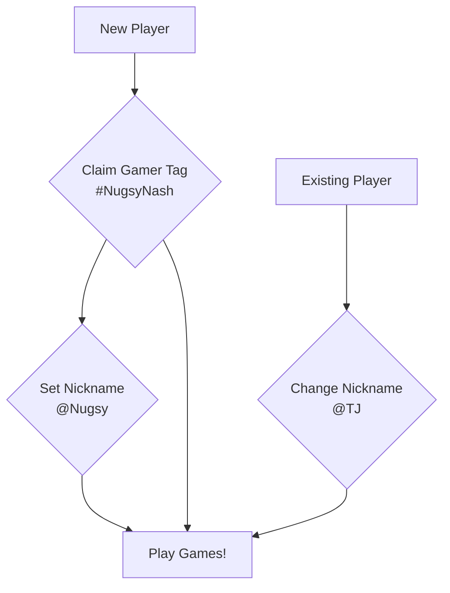

# Gamer-Tag.xyz

One-time, one-per-address, unique claimable gamer tags built and living on the blockchain. Once claimed, they can not be transferred.
Updatable nickname linked to each tag that players can optionally use to change their in-game display names whenever they want.

- [Contract Interface - IGamerTag](contracts/IGamerTag.sol)
- [Client Overview](client/README.md)

### Contracts currently deployed on:
- [Mumbai](https://mumbai.polygonscan.com/address/0x6e7ee11B05d525f9094352EC598d1a2ac790D61f#writeContract)

### Tools used:
- [Mermaid markdown charts](https://mermaid-js.github.io/mermaid/#/flowchart)