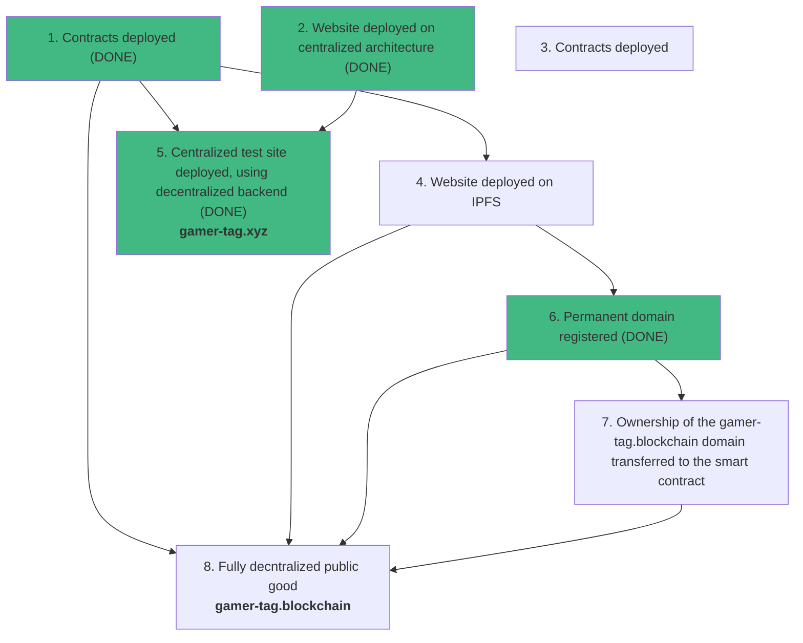

# gamer-tag dApp

One-time, one-per-address, unique claimable gamer tags built and living on the blockchain. Once claimed, they can not be transferred.
Updatable nickname linked to each tag that players can optionally use to change their in-game display names whenever they want.

### Path to Decentralization
This application is designed to be a public good owned by no one and requiring no maintenance or support to stay available. 
See the roadmap below to make sure that it remains that way for all-time. 

- No proxies, immutable contract. 
- No contract owner.
- Permanent domain registered through Unstoppable Domains.
- Website hosted on IPFS. 
- Domain ownership transferred to the smart contract.

- [Contract Interface - IGamerTag](contracts/IGamerTag.sol)
- [Client Overview](client/README.md)

### Contracts currently deployed on:
- [Mumbai Testnet](https://mumbai.polygonscan.com/address/TODO)
- [Polygon](https://polygonscan.com/address/TODO)

### Tools used:
- [OpenZeppelin](https://docs.openzeppelin.com/contracts/4.x/)
- [Truffle](https://trufflesuite.com/)
- [Mermaid markdown charts](https://mermaid-js.github.io/mermaid/#/flowchart)