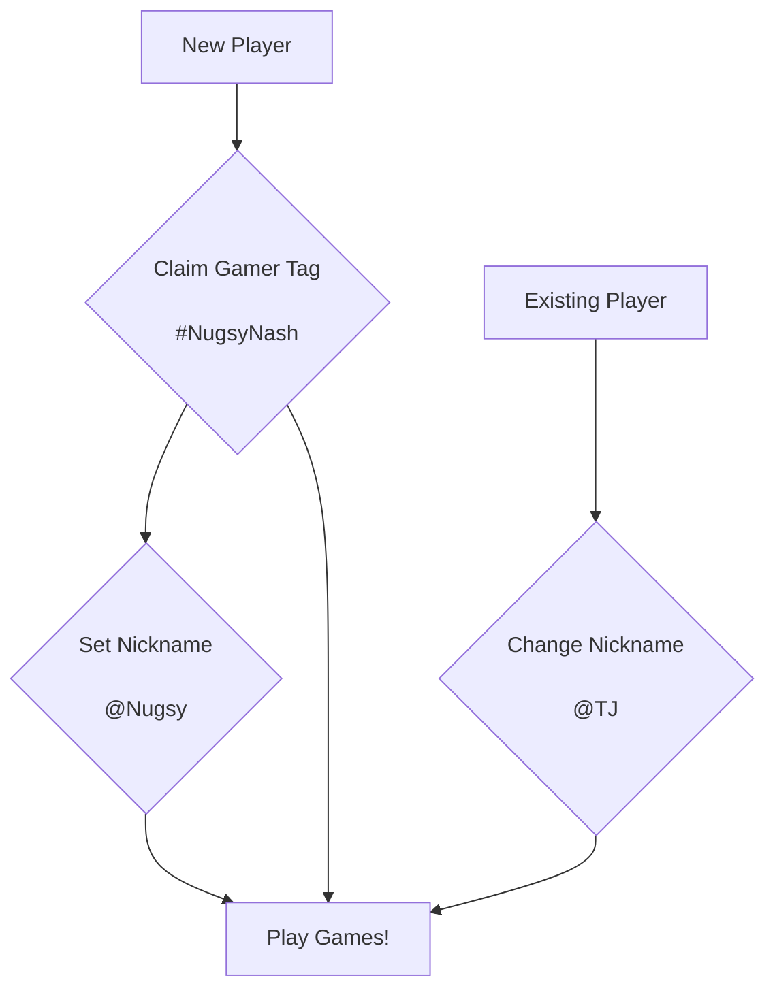

# gamer-tag front-end client

### Player flow
Outline of a player"s interaction with the application.

### Built with:
- [Bootstrapped with Create React App](https://github.com/facebook/create-react-app)
- [Material UI](https://mui.com/material-ui/)
- [RainbowKit - Wallet connect button](https://www.rainbowkit.com/docs/connect-button)
- [Wagmi - Smart contract React hooks](https://wagmi.sh/docs/getting-started)
- [Notistack - React library for notifications](https://notistack.com/api-reference)

### Resources:
- [Webapp Icon](https://www.pngrepo.com/svg/335572/game)